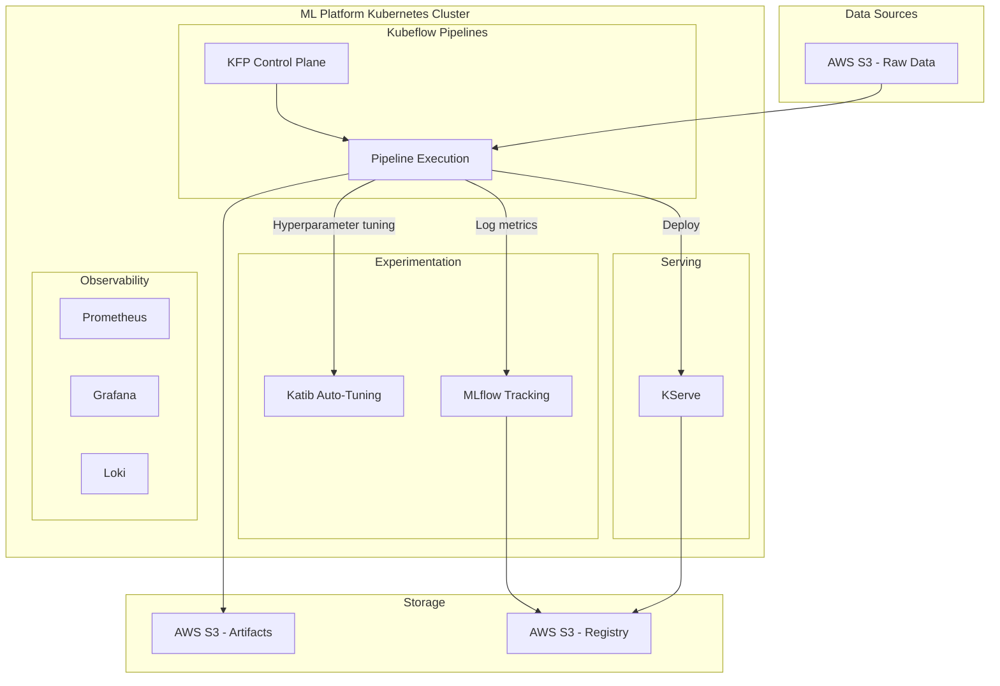

# High-Level Design (HLD)
## Enterprise ML Training Platform

### 1. Business Requirements
Data scientists spend excessive time on non-ML tasks like infrastructure provisioning, environment setup, and moving data manually. This platform aims to provide a centralized, self-service ML environment to streamline model development, optimization, deployment, and monitoring.

### 2. Architecture Diagram (Conceptual)

### 3. Component Overview
- **Data Ingestion & Preprocessing:** Kubeflow Pipelines fetch data from Amazon S3. 
- **Model Training:** Distributed training using PyTorch/XGBoost Operators.
- **Hyperparameter Tuning:** Katib automates searches for optimal learning rate, batch size, etc.
- **Model Registry & Tracking:** MLflow is the centralized registry for hyperparameters, metrics, and models.
- **Serving:** KServe provides serverless model inference with autoscaling capabilities.
- **Observability:** Prometheus scrapes metrics, Loki centralizes logs, Jaeger performs distributed tracing, and Grafana provides dashboards.

### 4. Data Flow
1. **Trigger**: Code push or scheduled cron job triggers KFP.
2. **Ingestion**: Raw data loaded from `s3://enterprise-ml-data`.
3. **Training & Tuning**: Katib orchestrates trial runs; metrics are streamed to MLflow.
4. **Registration**: The best performing model is packaged and registered in `s3://enterprise-model-registry`.
5. **Deployment**: KServe fetches the model from S3 and exposes an HTTP/gRPC endpoint.

### 5. Security Architecture
- **RBAC**: Kubernetes RBAC for namespace isolation. Kubeflow multi-user isolation ensures data scientists only see their own profiles.
- **Network Policies**: Deny-all by default, allowing only necessary intra-namespace and ingress traffic.
- **Secrets Management**: Kubernetes Secrets + IAM Roles for Service Accounts (IRSA) for secure S3 access.

### 6. Scalability Design
- **Autoscaling**: Cluster Autoscaler for node addition. Horizontal Pod Autoscaler (HPA) for KServe inferencing.
- **Distributed Training**: Kubeflow Training Operators utilize multiple pods across nodes for parallel data/model training.
